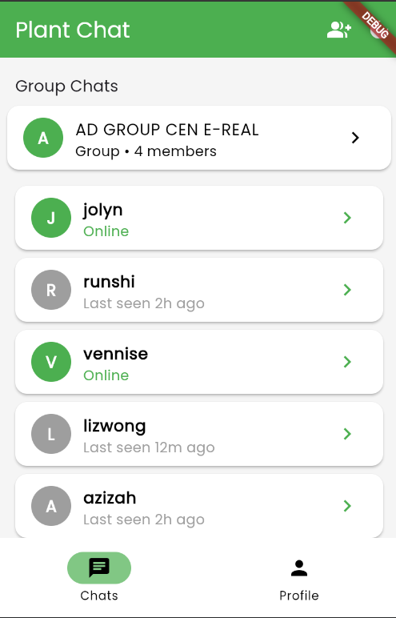
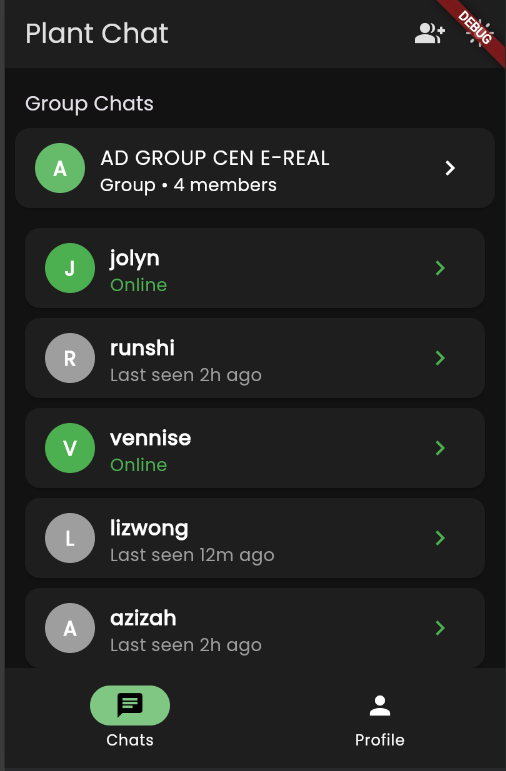
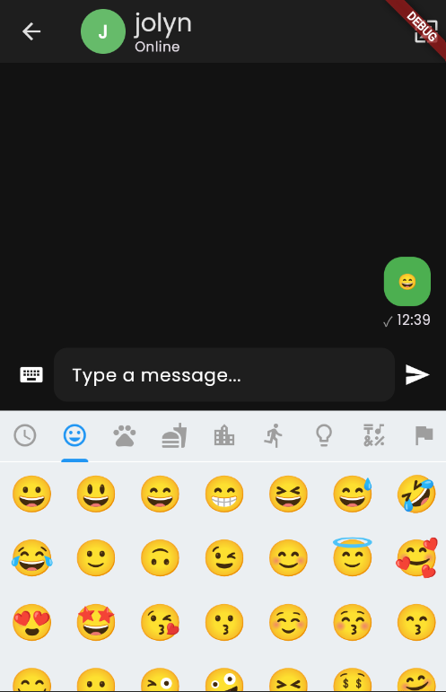

# 🌱 Plant Chat App 🌿

Welcome to **Plant Chat** — a beautiful, plant-themed real-time chat app built with Flutter and Firebase! 🌼

---

## 🌻 Features

- 🌵 **1-on-1 & Group Chats**
- 🌿 **Plant-inspired UI** (light/dark mode)
- 🌸 **Custom chat backgrounds**
- 🌼 **Message reactions, replies, and editing**
- 🌱 **Read receipts & typing indicators**
- 🌳 **User profiles with status**
- 🌺 **Group management (add/remove/rename)**
- 🍃 **Lottie animations for empty states**

---

## 🌷 Screenshots

<div align="center">
  
  <br><sub>🌱 Home & Chat List</sub>
  <br><br>
  
  <br><sub>🌿 Group Chat in Action</sub>
  <br><br>
  
  <br><sub>🌸 Profile & Planty Settings</sub>
</div>

---

## 🌵 Getting Started

1. **Clone the repo:**
   ```sh
   git clone https://github.com/yourusername/plant-chat.git
   cd plant-chat
   ```
2. **Install dependencies:**
   ```sh
   flutter pub get
   ```
3. **Firebase setup:**
   - Add your `google-services.json` (Android) and `GoogleService-Info.plist` (iOS) to the project.
   - For web, update `firebase_options.dart` with your config.
4. **Run the app:**
   ```sh
   flutter run -d chrome
   ```

---

## 🌼 Tech Stack
- **Flutter** (Dart)
- **Firebase** (Auth, Firestore)
- **Provider** (state management)
- **Lottie** (animations)
- **emoji_picker_flutter** (emoji reactions)

---

## 🌿 Contributing

Pull requests are welcome! For major changes, please open an issue first.

---

## 🌻 License

[MIT](LICENSE)

---

> _Happy chatting and let your conversations blossom!_ 🌱💬
